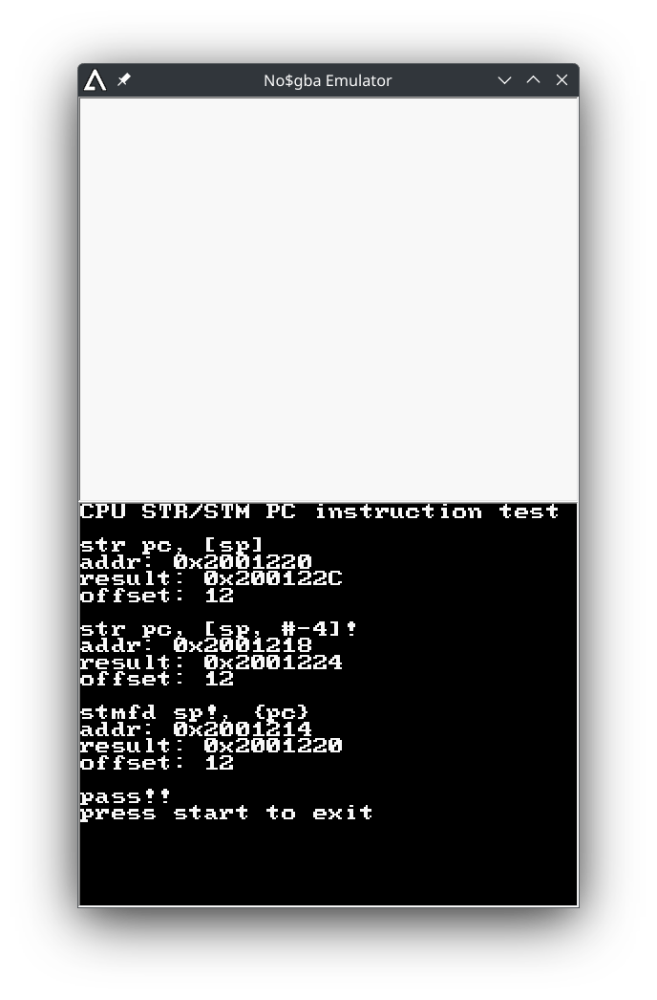
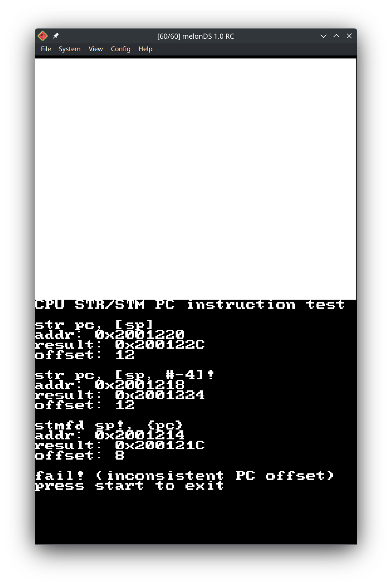

# NDS-STR-PC-Accuracy-Test

Test the `STR` (Store Register) and `STM` (Store Multiple Registers) instructions on your Nintendo DS.

## Why?
While working on some code for the DS, I found an inaccuracy in MelonDS. To quote the ARM Reference Manual:

> An exception to the above rule occurs when an ARM STR or STM instruction stores R15 [the program counter]. Such instructions can store either the address of the instruction plus 8 bytes, like other instructions that read R15, or the address of the instruction plus 12 bytes. **Whether the offset of 8 or the offset of 12 is used is IMPLEMENTATION DEFINED. An implementation must use the same offset for all ARM STR and STM instructions that store R15. It cannot use 8 for some of them and 12 for others.**

On a real Nintendo DS, the program counter offset is always 12 - this is a valid configuration. No$GBA emulates this correctly (see above).

However, on MelonDS, an issue was found. When executing a `STR` instruction, the offset is 12 - this is correct. But when executing a `STM` instruction, the offset is 8 - this is invalid, and worse yet, is out of spec. (If it was consistently 8 - like DeSmuME - the code likely would have worked, even if the emulation was inaccurate.)

This code will execute three variants on `STM` and `STR`, and take note of the offsets produced. If they are always 12, then the test is passed. Otherwise, the failure reason is logged to the lower sceren.